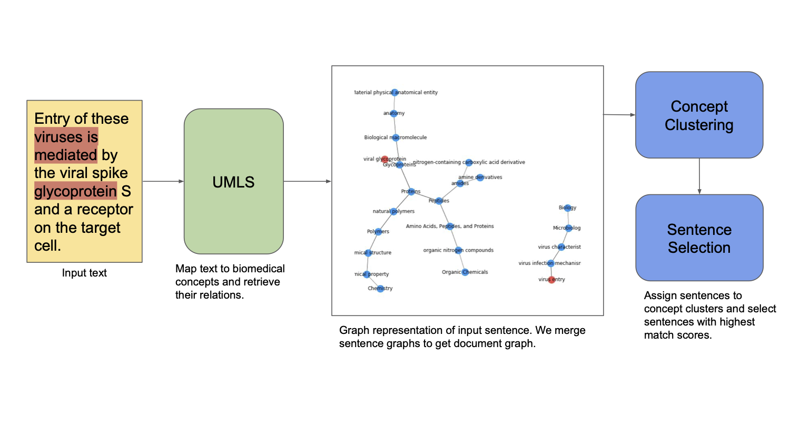

### Abstract

COVID-19 pandemic is an emerging and rapidly evolving situation. In response to this situation, research groups have collected an enormous volume of scholarly related articles. However, accessing such vast body of biomedical literature may be inconvenience and ineffective without using summarize tools. In this project, we develop a graph-based algorithm to extractively summarize biomedical research literatures. We employ biomedical domain-specific knowledge by incorporating the Unified Medical Language System (UMLS) into our algorithm.  We evaluate our algorithm using the CORD-19 dataset. The result shows that our algorithm can successfully identify sentences cover the main topic of the document. 

### Overview

### Prerequisites

To run the algorithm, the following programs/packages need to be installed:

* [UMLS Metathesaurus](https://www.nlm.nih.gov/research/umls/knowledge_sources/metathesaurus/index.html): this project
is developed using UMLS Metathesarus 2019-AB version. 
* [UMLS Metamap](https://metamap.nlm.nih.gov/): UMLS Metamap is used to map text to concepts. 
* MySQL: We use the MySQL load script provided with UMLS Metathesaurus to load it to MySQL database, then use `pymysql`
to communicate with the main program.
* [PyMedTermino](https://pythonhosted.org/PyMedTermino/): is used to access the terminology in UMLS. 

